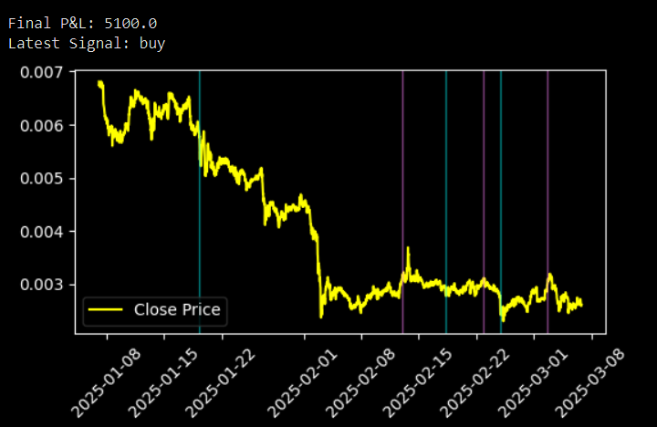

Simple Price Channel Breakout Trading Strategy

  

Description:
This Python script fetches historical cryptocurrency price data, identifies buy/sell signals based on price breakouts, calculates profit/loss, and plots the results. 
It looks at the highest high and lowest low over the last 250 bars to determine trade signals. The logic is kept simple, using only arrays and sorting instead of complex functions. 
Buy and sell points are marked with green and red vertical lines on the price chart.

  

💡 Summary
✔ Fetches data (closing prices, highs, lows).
✔ Identifies breakout signals (Price Channel Strategy).
✔ Calculates P&L and displays latest signal.
✔ Plots signals on the price chart.

